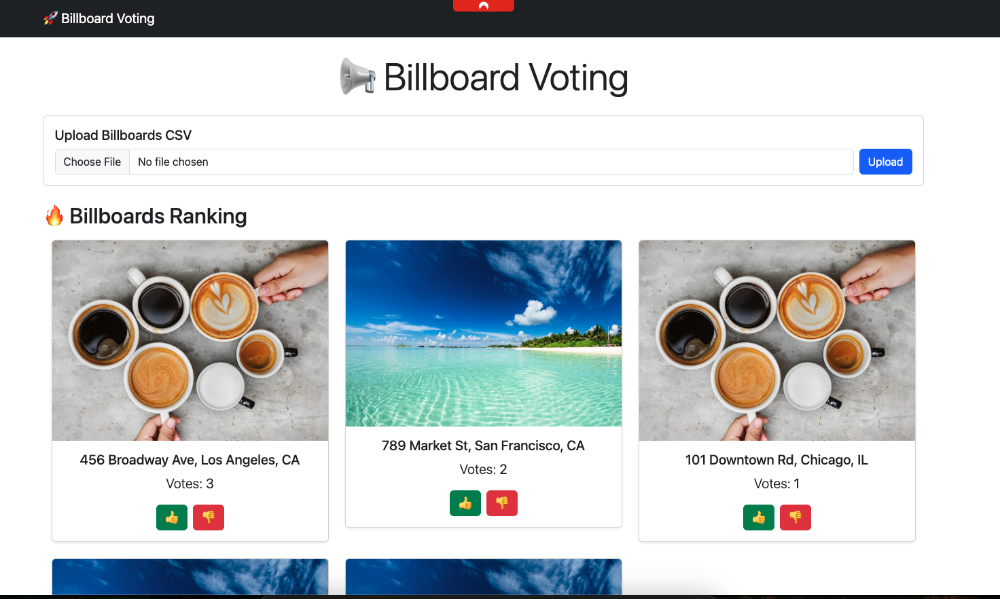
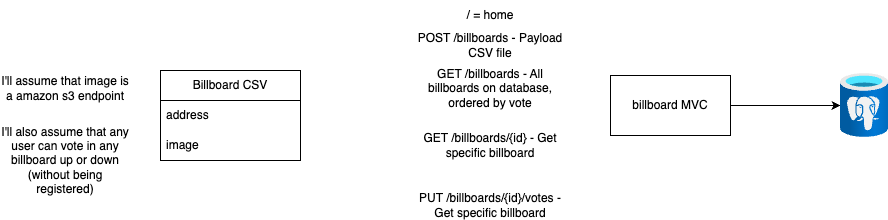

# Billboard Voting

## 📌 Project Overview
The **Billboard Voting** app allows users to vote on billboards **without registration**. Users can upvote or downvote billboards, and the system dynamically **orders billboards based on votes**.

The application assumes:
- **Image URLs** are **Amazon S3 endpoints**.
- **Any user** can vote up or down **without authentication**.

## 🖼️ Website Screenshot
A preview of the website is available below:


## 📐 Architecture
Here is a initial simple architecture diagram:


## 🛠️ Technologies Used
- **Ruby on Rails** - Backend framework
- **Hotwire (Turbo & Stimulus)** - Real-time UI updates
- **PostgreSQL** - Database (chosen for scalability, but DynamoDB or Aurora could be used)
- **Bootstrap** - Frontend styling framework
- **Docker & Docker Compose** - Local development and production deployment

## 🚀 Running the Project Locally
### **Prerequisites**
Make sure you have **Docker** installed before running the project.

### **Steps to Run Locally**
1. Start **PostgreSQL using Docker**:
   ```sh
   docker-compose up -d
   ```
2. **Run database migrations**:
   ```sh
   bin/rails db:migrate
   ```
3. **Start the Rails server**:
   ```sh
   bin/rails s
   ```

### **Testing with a Sample CSV**
A sample file for billboard testing is located at:
[Sample CSV](resources/tests/billboards_sample.csv)

You can upload this CSV to test bulk billboard ingestion.

## 🌍 Deploying to Production
### **Docker & Containerization**
- The project includes a **Dockerfile** to containerize the application.
- Deployable on **Kubernetes, ECS, or another container engine**.

### **Database in Production**
- **Recommended setup**: Use **Amazon RDS or Aurora PostgreSQL**.
- **Environment variables** should be configured for database credentials.
- Alternatively, database credentials can be securely stored in **AWS Secrets Manager**.